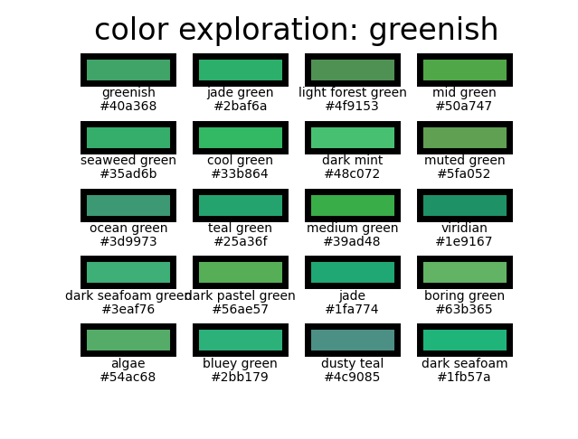

# colors

This is my favorite directory. You will find all kind of snippets that will help you
bring more colors to your scripts and plots. 

I hope you will find amusement here !
<hr style="border:2px solid gray"> </hr>

## Structure 
```
colors/
├── colorbars/
├── access_xkcd.py
├── display_mpl_colors.py
├── explore_xkcd_colors.py
└── hex_rgb_convertion.py
```

<hr style="border:2px solid gray"> </hr>

## colorbars
>
>Well I've spent so much time looking for the right way to build custom colorbars
>from my imagination and from screenshots. 
>
>This directory aims to gather the most simple scripts to do all that messy stuff! 
---
## access_xkcd.py
>> author: JBocage
>
>This snippet provides a function that can be used to get codes of a huge colors dataset.
>
>The available colors are accessible at https://xkcd.com/color/rgb/

---
## display_mpl_colors.py
>> source-url: https://matplotlib.org/stable/gallery/color/named_colors.html
>
>This code is taken from the matplotlib website. It plots different color tables
>that are inbuilt in matplotlib.

---
## explore_xkcd_colors.py
>> author: JBocage
>
>This script aims to provide a tool for the user to explore the xkcd color dataset and find the right color that best
>fits their expectations.
>
>When running this script, the user is asked to input a color name (see exemple below).
>
>```
>Please enter a color name >greenish
>```
>
>If the color name is in the xkcd color dataset (cf https://xkcd.com/color/rgb/),
>the plot is updated to display all the nearest colors in the rgb space that are contained in the xkcd dataset.
>Then the script asks for a new color to be entered.
>
>To end the loop, you can type
>
>```
>Please enter a color name >stop
>```
>
>Exemple output :
>
><p align="center">
>

---
## hex_rgb_convertion.py
>> source-url: https://stackoverflow.com/questions/29643352/converting-hex-to-rgb-value-in-python
>
>This script contains function that help convert hex color value to and from rgb values
>
>```python
>def hex_to_rgb(value):
>    value = value.lstrip('#')
>    lv = len(value)
>    return tuple(int(value[i:i + lv // 3], 16) for i in range(0, lv, lv // 3))
>
>
>def rgb_to_hex(rgb):
>    return '#%02x%02x%02x' % rgb
>```
>

---


<sub>This doc was automatically generated with makedoc v1.1.6 on  03/15/22 15:47:24 