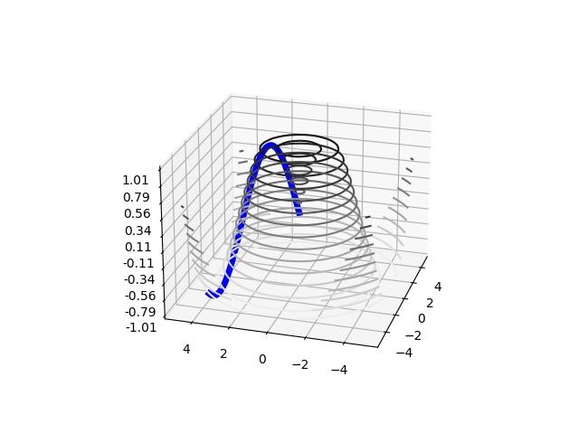

# 3D_plots

This directory contains that generate quick or complex 3D plots.
<hr style="border:2px solid gray"> </hr>

## Structure 
```
3D_plots/
└── plot_contour_and_line.py
```

<hr style="border:2px solid gray"> </hr>

## plot_contour_and_line.py
>> inspiration-url: https://jakevdp.github.io/PythonDataScienceHandbook/04.12-three-dimensional-plotting.html
>
>This code is taken from the a github project and shows how to make a contour plot and to plot a line on the surface.
>
>The plotting code is
>
>```python
># Plot the contour and the line.
>ax.contour3D(X, Y, Z,
>            15,
>            cmap = 'binary',
>            )
>ax.plot3D(xline, yline, zline, linewidth=5, c='b')
>```
>
>A result example is given in the following figure.
>
><p align="center">
>

---


<sub>This doc was automatically generated with makedoc v1.1.6 on  03/15/22 14:57:19 