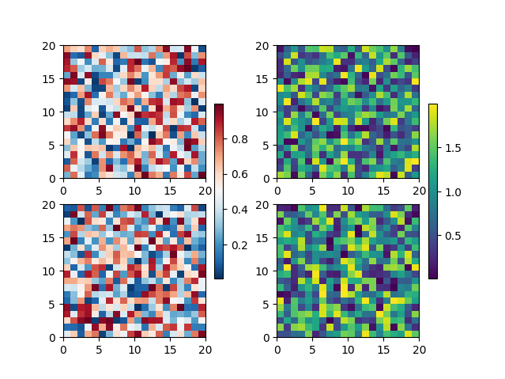

# matplotlib

Well, the matplotlib website is really furnished, so you should definitely give it a chance. 
Plus the main part of the script you will find here come from there.
<hr style="border:2px solid gray"> </hr>

## Structure 
```
matplotlib/
├── 3D_plots/
│   └── plot_contour_and_line.py
└── color_bar_integration.py
```

<hr style="border:2px solid gray"> </hr>

## 3D_plots
>
>This directory contains that generate quick or complex 3D plots.
---
## color_bar_integration.py
>> source-url: https://matplotlib.org/3.5.1/gallery/subplots_axes_and_figures/colorbar_placement.html
>
>This code is taken from the matplotlib website. It clearly demonstrates **how matplotlib handles colorbar adding
>on figures**.
>
>_BONUS_: it also shows how to merge axes for colorbar plotting.
>
>A result example is given in the following figure.
>
><p align="center">
>

---


<sub>This doc was automatically generated with makedoc v1.1.6 on  03/15/22 10:57:27 